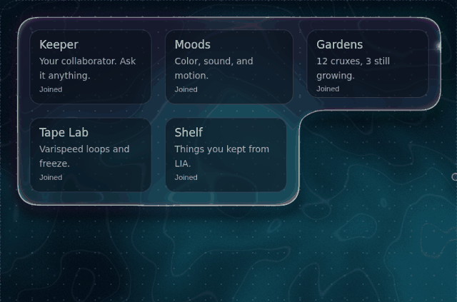

# Plasma UI

Liquid panels for React, rendered in WebGL on canvas, inspired by Apple's Liquid Glass design. The `<Plasma>` panel looks and behaves like liquid, with surface tension that fuses on contact with other panels. Anything visible behind the panel is refracted. And for layout convenience, the panels ultimately snap to a grid layout. The library is a work in progress, extracted from the [Crux Garden](https://github.com/cruxgarden) project, but it seemed useful enough to share in its current form.



[Playground and Docs](https://cruxgarden.github.io/plasma-ui/) · [Workspace example](https://cruxgarden.github.io/plasma-ui/examples/workspace/)

**Status: 0.3.0.** Core is stable and tested, but the API may change.

```bash
npm install @cruxgarden/plasma-ui
```

Zero dependencies, except for React. Best on desktop: the effect is GPU-heavy
and does not run well on mobile.

```tsx
import { PlasmaProvider, Plasma } from "@cruxgarden/plasma-ui";

export function App() {
  return (
    <PlasmaProvider mood="tidal">
      <Plasma as="header" lean={false}>
        My App
      </Plasma>
      <Plasma draggable>
        <h3>Inbox</h3>
      </Plasma>
    </PlasmaProvider>
  );
}
```

## Example

[`examples/workspace`](examples/workspace) demonstrates how the library can be used for a real-world dashboard layout.

## `<PlasmaProvider>`

| Prop                       | Type                                     | Default        | Description                                                                                                                                                                          |
| -------------------------- | ---------------------------------------- | -------------- | ------------------------------------------------------------------------------------------------------------------------------------------------------------------------------------ |
| `mood`                     | `"tidal" \| "aurora" \| "ember" \| Mood` | `"tidal"`      | Colors, blend distance, and spring feel                                                                                                                                              |
| `theme`                    | `"auto" \| "light" \| "dark"`            | `"auto"`       | Auto follows the OS and `<html data-theme>`                                                                                                                                          |
| `radius`                   | `number`                                 | `26`           | Default corner radius (px) for every surface                                                                                                                                         |
| `background`               | `BackgroundSource`                       |                | Any CSS color (luminance drift), image URL (refracted, slow swirl), or an `img`/`canvas`/`video` element - canvas and video update live. Dynamic. Omit for the procedural mood field |
| `blend`                    | `number`                                 | mood           | Distance (px) at which surfaces start to fuse                                                                                                                                        |
| `viscosity`                | `number`                                 | `0.5`          | `0` is watery and bouncy, `1` is slow like syrup; also scales drag and snap springs                                                                                                  |
| `stretch`                  | `number`                                 | `1`            | How far the plasma trails behind moving panels; `0` turns it off                                                                                                                     |
| `flow`                     | `number`                                 | `0`            | Slow ripple along the edges                                                                                                                                                          |
| `tint`                     | `string`                                 | `"#ffffff"`    | Plasma color (hex)                                                                                                                                                                   |
| `opacity`                  | `number`                                 | `0`            | Tint strength, 0 (clear) to 1 (solid color)                                                                                                                                          |
| `frost`                    | `number`                                 | `0`            | Translucency, 0 (clear) to 1 (frosted)                                                                                                                                               |
| `elevation`                | `number`                                 | `0.35`         | Shadow depth, 0 (flat) to 1 (floating); dragged surfaces raise automatically                                                                                                         |
| `smoothness`               | `number`                                 | `1`            | Outline smoothing strength                                                                                                                                                           |
| `refraction`, `dispersion` | `number`                                 | `1`            | Lens strength, color splitting                                                                                                                                                       |
| `rim`                      | `number`                                 | `1`            | Colored rim strength; `0` turns it off                                                                                                                                               |
| `rimColor`                 | `"iridescent" \| "tint" \| string`       | `"iridescent"` | Rainbow sheen, each surface's tint, or a hex color                                                                                                                                   |
| `rimWidth`                 | `number`                                 | `1`            | How far the rim reaches in from the edge                                                                                                                                             |
| `highlight`                | `number`                                 | `1`            | Pointer-facing highlight; `0` turns it off                                                                                                                                           |
| `edgeLine`                 | `number`                                 | `1`            | Thin line along the outline; `0` turns it off                                                                                                                                        |
| `shimmer`                  | `number`                                 | `1`            | The slow iridescent sheen that drifts across the body of each surface; `0` turns it off                                                                                              |
| `glow`                     | `number`                                 | `1`            | The halo of color the plasma casts on the background around it - the soft light that is still there at `elevation={0}`; `0` turns it off                                             |
| `wash`                     | `number`                                 | `1`            | How much of its own cast the material puts on what you see through it; `0` passes the background straight through                                                                    |
| `grain`                    | `number`                                 | `1`            | Film grain over the background (never over the surfaces); `0` turns it off                                                                                                           |
| `backgroundBlur`           | `number`                                 | `0`            | Blur the background itself, in CSS px (0-40). Unlike `frost`, which blurs only what a frosted surface sees, this softens the whole field                                              |
| `ground`                   | `"field" \| "clear"`                     | `"field"`      | What the canvas shows where there is no surface. `"clear"` leaves it transparent, so a second provider's canvas can sit above other content (a dialog above a scrim) and draw only its surfaces; pass the first provider's canvas as its `background` and the surfaces refract it |
| `preserveDrawingBuffer`    | `boolean`                                | `false`        | Keep each frame after it is shown so another provider can sample this canvas as its `background`. Fixed at creation |
While a surface forms in (about half a second, never under reduced motion) its element carries `data-plasma-forming` (`FORMING_ATTR`). Style its children off it to have the contents arrive after the material: `[data-plasma-forming] > * { opacity: 0 }` with a transition on opacity.

| `material`                 | `MaterialName`                           | `"plasma"`     | What the surfaces are made of: `plasma`, `crystal`, `metal`, `wood`, `stone` or `cloud`. Every material shares the same geometry, springs and fusing and differs only in how it is shaded - see [`examples/materials`](examples/materials) |
| `lightDir`                 | `[number, number, number]`               | up-left, front | Where the one light comes from. Every opaque material reads it, so two of them on a page agree about the sun                                                                          |
| `roughness`                | `number`                                 | `0.28`         | Surface finish for `metal`: 0 is a mirror, 1 is chalk                                                                                                                                |
| `anisotropy`               | `number`                                 | `0`            | How far a highlight stretches along the grain. Brushed metal and varnished wood both want it                                                                                          |
| `edge`                     | `number`                                 | `0`            | How far the outline is displaced from its rounded box, in CSS px. A rounded rectangle is right for a liquid and wrong for most else: stone chips, cloud billows, cut metal does neither |
| `edgeScale`                | `number`                                 | `0.01`         | Size of that displacement, in cycles per px: small is billows, large is chips                                                                                                        |
| `edgeSharpness`            | `number`                                 | `0`            | `0` rolls the displaced edge, `1` breaks it into flats and points                                                                                                                    |
| `thickness`                | `number`                                 | `18`           | How thick a panel is **as a solid**, in CSS px. The marched materials light a body of this depth rather than shading a flat card                                                      |
| `tension`                  | `number`                                 | `0`            | Surface tension: how hard the material pulls its own shape toward a bead, and how eagerly two of them merge. `mercury` runs high                                                      |
| `pointerDrop`              | `boolean`                                | `true`         | Liquid drop that follows the pointer                                                                                                                                                 |
| `ambientDrops`             | `boolean`                                | `false`        | Decorative orbiting drops                                                                                                                                                            |
| `grid`, `magnet`           | `number`                                 | `24`, `40`     | Snap grid size and edge latch distance                                                                                                                                               |
| `quality`                  | `number`                                 | `1.25`         | Maximum canvas pixel ratio                                                                                                                                                           |
| `freezeOnScroll`           | `boolean`                                | `false`        | Touch devices only: pin the last drawn frame to the page through a fling and resume when the scrolling stops                                                                          |
| `maxSurfaces`              | `number`                                 | `16`           | Visible surface budget, compiled into the shaders; changing it rebuilds them, and higher costs GPU time                                                                              |
| `zIndex`                   | `number`                                 | `-1`           | Canvas stacking order                                                                                                                                                                |
| `canvas`                   | `boolean`                                | `true`         | `false`: render [`<PlasmaCanvas />`](#plasmacanvas) yourself to choose where the element sits and how it is styled                                                                    |

## `<Plasma>`

Accepts all HTML attributes, plus the following:

| Prop                                    | Type                     | Default  | Description                                                                                                         |
| --------------------------------------- | ------------------------ | -------- | ------------------------------------------------------------------------------------------------------------------- |
| `as`                                    | `ElementType`            | `"div"`  | Element or component to render. Its props typecheck through: `as="a"` takes `href`, `as={Link}` takes `to`           |
| `radius`                                | `number`                 | provider | Corner radius (px) for this surface                                                                                 |
| `lean`                                  | `number \| false`        | `10`     | Lean toward the pointer while standalone                                                                            |
| `tint`, `opacity`, `frost`, `elevation` | `string`, `number`       | provider | Color, translucency, and shadow depth for this surface; joined surfaces with different values blend into each other |
| `padding`                               | `number`                 |          | Inner padding (px); halves on joined edges so gutters between fused panels equal the free-edge inset                |
| `fuse`                                  | `boolean`                | `true`   | `false`: this surface never blends, bridges, or joins with others - for bars, docks, and fixed chrome               |
| `draggable`                             | `boolean`                | `false`  | Move freely, snap on release; arrow keys move one grid step                                                         |
| `snap`                                  | `boolean`                | `true`   | Latch to neighbor edges, otherwise the grid                                                                         |
| `bounds`                                | `RefObject<HTMLElement>` | viewport | Drag area and grid origin                                                                                           |
| `group`                                 | `string`                 |          | Snap only against surfaces in the same group; surfaces with no group form one group of their own                    |
| `offset` / `defaultOffset`              | `{ x, y }`               |          | Controlled or initial offset; changes spring into place                                                             |
| `onDragStart`, `onDragEnd(offset)`      |                          |          | Drag lifecycle; `onDragEnd` gets the settled offset                                                                 |
| `onJoinChange(joined)`                  |                          |          | Fires when the surface fuses with or separates from a neighbor                                                      |

Everything else you pass goes to the rendered element. `PlasmaProps<C>` is the
full prop type for `<Plasma as={C}>`; `PlasmaOwnProps` is just the table above,
if you need to wrap `Plasma` in a component of your own.

Drag ignores presses on buttons, links, inputs, and anything marked `data-plasma-nodrag`.

## Hooks

| Hook                  | Returns                                                                       |
| --------------------- | ----------------------------------------------------------------------------- |
| `usePlasmaRuntime()`  | `renderer`, `supported`, `reducedMotion`, `pulse(x, y, strength?)`, `bump(energy)` |
| `usePlasmaDefaults()` | `tint`, `opacity`, `frost`, `radius`, `grid`, `magnet`, `spring`               |
| `usePlasma()`         | both of the above, in one object                                              |

`usePlasmaRuntime()` is the one to reach for when you only need `pulse`: its
value is stable, so a component reading it is not re-rendered every time a
styling prop on the provider changes. `usePlasma()` is the convenient one and
re-renders on any change.

## `<PlasmaCanvas>`

The provider renders the canvas itself unless you pass `canvas={false}`, in
which case render `<PlasmaCanvas />` wherever you want the element to live:

```tsx
<PlasmaProvider canvas={false}>
  <div className="page-backdrop" />
  <PlasmaCanvas zIndex={0} className="field" />
  <main>...</main>
</PlasmaProvider>
```

It takes `className`, `style` and `zIndex`. Note that this places and styles
the **element**; the renderer still draws the whole viewport. Confining the
field to a container is [roadmap](#roadmap) work, not something this prop does.

## Clear as water

Six things give the material a look of its own, and each is a separate
control, so "plain glass, nothing but the lens" is a configuration rather than
a fork:

```tsx
<PlasmaProvider
  rim={0} // the iridescent edge
  highlight={0} // the specular that follows the pointer
  shimmer={0} // the sheen drifting across the body
  glow={0} // the halo cast on the background - visible even at elevation 0
  wash={0} // the material's own tint on what you see through it
  grain={0} // film grain on the background
  edgeLine={0.35} // a hairline is usually still wanted: it is what reads as an edge
  refraction={1.5}
  dispersion={1.6}
/>
```

The **Aqua** tab in the [playground](https://cruxgarden.github.io/plasma-ui/)
is exactly this, with all six sliders live next to it.

Two of these answer questions that come up often: the faint rainbow that never
went away no matter how far `rim` came down is `shimmer`, and the soft light
still hugging a panel at `elevation={0}` is `glow` - it is cast by the plasma,
not by the shadow, which really is off at `0`.

## Custom moods

```ts
import type { Mood } from "@cruxgarden/plasma-ui";

const dusk: Mood = {
  colors: ["#0b0816", "#3b2a6b", "#f0a868"],
  blend: 40,
  spring: { stiffness: 150, damping: 14 },
};
```

## Motion

Each panel undulates like a Slinky when moving. Three properties control this movement: viscosity, stretch, and flow.

```tsx
<PlasmaProvider viscosity={0.1} stretch={1.3} flow={0.6} />  // water
<PlasmaProvider viscosity={0.85} stretch={1.8} />            // honey
<PlasmaProvider stretch={0} />                               // the plasma tracks panels exactly
```

NOTE: `flow` ripples the outline, so leave it at `0` whenever flush edges should stay perfectly straight.

## Styling the rim (fancy outline)

```tsx
// solid cyan rim, a bit wider, no pointer highlight
<PlasmaProvider rimColor="#5fd4ff" rimWidth={1.6} highlight={0} />

// each panel's rim follows its own tint
<PlasmaProvider rimColor="tint">
  <Plasma tint="#ff5fa2" opacity={0.3} />
</PlasmaProvider>

// plain plasma: no colored rim, just the edge line
<PlasmaProvider rim={0} />
```

## Guidelines

- Use Plasma for container components: panels, docks, cards, dialogs. Components should be nested inside.
- Place surfaces together or further apart than the Blend distance. Smaller gaps render as liquid bridging them.
- Up to `maxSurfaces` (default 16) draw at once; offscreen panels are skipped first, and the library warns in the console when it has to drop any. Two render passes loop over every slot per pixel, so set this value only as high as you need. Changing it recompiles the shaders, so change it when the layout changes, not per frame.
- Lean and Pulse use the CSS `translate` and `scale` properties, and Drag uses `transform`. Avoid setting these properties on `Plasma` elements yourself.
- `prefers-reduced-motion` disables Lean, Pulse, the pointer Drop, and Spring.

## Roadmap

Ordered by priority:

1. **Layers** - panels that will stack instead of fusing. For use with dialogs, menus, and such.
2. **Drag handles and resize** - will add a `handle` prop for dragging, so panel content can be fully interactive. Also, edge resizing with grid snapping.
3. **Scroll clipping** - plasma confined to scrollable containers.
4. **Pluggable Backgrounds** - colors, images, and live canvas/video shipped in 0.1 (`background` prop); custom shaders are next.
5. **Shapes and Orientation** - non-rectangular outlines, rotation...etc.

Contributions welcome for any of these - see [CONTRIBUTING.md](CONTRIBUTING.md).

## Browser support

Chrome, Edge, Firefox, and Safari 16.4+ (WebGL2). In non-supported browsers, `Plasma` renders as a CSS frosted panel and all layout, drag, and snap behavior still works.

**Use it on the desktop.** Every pass is full-viewport, so the cost scales with
the canvas, and phones pay it at a device pixel ratio the effect does not need.
It runs on mobile - resolution drops past a pixel budget, and `freezeOnScroll`
pins the last frame through a fling - but it is not where this belongs.

Server rendering works: surfaces come out as the CSS fallback with no layout
effect warnings, and the canvas takes over on hydration.

## Development

```bash
npm install
npm run build          # library → dist/
npm run build:site     # docs + playground → site/dist/index.html
npm run build:example  # workspace example → examples/workspace/dist/index.html
npm run build:pages    # both, in the layout GitHub Pages serves → site/dist/
npm test               # snap-logic tests
npm run verify         # typecheck + tests + build, the gate CI runs
```

Every page is a single self-contained HTML file, so you can open one straight
from disk. `scripts/build-page.mjs` is the one builder they share.

Pushing to `main` deploys `npm run build:pages` to GitHub Pages:

- Site: https://cruxgarden.github.io/plasma-ui/
- Workspace example: https://cruxgarden.github.io/plasma-ui/examples/workspace/

Releases go to npm from a local machine, the same way the Crux Garden CLI
does — see [PUBLISH.md](PUBLISH.md).

## Used by

- [Crux Garden](https://github.com/cruxgarden) - the project Plasma UI was originally built for.

Using it in something? Add yours in a PR.

## Contributing

Contributions are welcome - bug reports, fixes, and roadmap features alike.

1. Fork the repo and create a branch from `main`.
2. `npm install`, make your change, and keep `npm test` and `npm run typecheck` green.
3. Rebuild the docs site (`npm run build:site`) and click through the five nav configurations - it's the integration test.
4. For visual changes, include before/after screenshots in the PR.
5. Open a pull request with a short description of what changed and why.

See [CONTRIBUTING.md](CONTRIBUTING.md) for the code layout and a list of known gaps that make good first projects. By contributing, you agree that your contributions will be licensed under the MIT license.

## Acknowledgements

Plasma UI is built on well-known graphics and simulation techniques:

- **Blobby surfaces / metaballs** - the fuse-on-contact behavior descends from Jim Blinn's [_A Generalization of Algebraic Surface Drawing_](https://dl.acm.org/doi/10.1145/357306.357310) (1982).
- **Signed distance fields** - the material is drawn with 2D SDFs combined by smooth minimum, per Inigo Quilez's [2D distance functions](https://iquilezles.org/articles/distfunctions2d/) and [smooth minimum](https://iquilezles.org/articles/smin/) articles; the procedural background uses his [fBM](https://iquilezles.org/articles/fbm/) construction.
- **Spring integration** - panel motion uses semi-implicit Euler with fixed substeps, in the spirit of Glenn Fiedler's [_Integration Basics_](https://gafferongames.com/post/integration_basics/).
- **The optical treatment** (refraction, dispersion, frost) is an original WebGL take on the direction popularized by Apple's [Liquid Glass](https://developer.apple.com/design/human-interface-guidelines/materials) material.

## License

[MIT](LICENSE)
